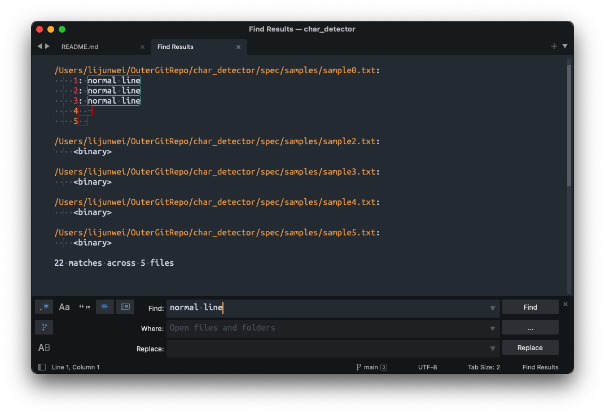

+ TODO enhance refering to https://ruby-doc.org/core-3.1.2/Regexp.html#class-Regexp-label-Character+Properties

# CharDetector

## What

This tool helps find whether a file contains [ASCII control characters](https://theasciicode.com.ar/), print location info if true.

## Why

It's annoying while working with sublime search. If a file somehow contains a ASCII control characters, it'll be treated as "binary" and won't show the result preview. And this kind of "binary" files tweaks the behavior of text editor.

So I'd like to find these files and get rid of these control characters very much.



Ref: [ASCII table , ascii codes](https://theasciicode.com.ar/)

## Roadmap

+ Google keyword: "sublime search result binary"
    + result: https://stackoverflow.com/questions/26030179/sublime-text-find-in-files-gives-binary-in-the-find-results
    + result: https://exchangetuts.com/sublime-text-find-in-files-gives-binary-in-the-find-results-1640166664392553
    + these two results above are not helpful
    + result: https://blog.csdn.net/wozhouwang/article/details/101672976 (this one actually is the solution in python, but I didn't understand "control character" yet)
+ I reviewed [character encoding notes/unicode](https://github.com/liijunwei/practice/tree/main/unicode)
+ I found that if I open the abnormal file with vim, the character show up, I google search taught me that they are control characters
    + [search with [[:cntrl:]] in vim](https://stackoverflow.com/questions/3844311/how-do-i-replace-or-find-non-printable-characters-in-vim-regex)
+ I found a word called ["POSIX bracket expressions"](https://www.regular-expressions.info/posixbrackets.html)
    + I found the ruby version in [Ruby Core Doc@Regexp](https://ruby-doc.org/core-3.1.2/Regexp.html#class-Regexp-label-Character+Properties)
+ I wrote a temperary ruby script scanning abnormal files
+ I setup a ruby gem and TDD my script
    + bundle gem char_detector
+ Test and fix and refactor

## Installation(WIP)

Add this line to your application's Gemfile:

```ruby
gem 'char_detector'
```

And then execute:

```bash
bundle install
```

Or install it yourself as:

```bash
gem install char_detector
```

## Usage

### demo on detecting in single file

```bash
# eaiser
grep -a '[[:cntrl:]]' spec/samples/*.txt

bin/char_detector -f spec/samples/sample0.txt
bin/char_detector -f spec/samples/sample1-newline.txt
bin/char_detector -f spec/samples/sample2.txt
bin/char_detector -f spec/samples/sample3.txt
bin/char_detector -f spec/samples/sample4.txt
bin/char_detector -f spec/samples/sample5.txt
```


### demo on detecting in file directory and file pattern

```bash
# parallel is GNU parallel to speed up the scanning process
# macos: https://formulae.brew.sh/formula/parallel

# with pattern
parallel --progress --timeout 50 --retries 3 "bin/char_detector -f {}" ::: $(find spec/samples -name \*.txt)
parallel --progress --timeout 50 --retries 3 "bin/char_detector -f {}" ::: $(find spec/samples -name \*.md)
parallel --progress --timeout 50 --retries 3 "bin/char_detector -f {}" ::: $(find spec/samples -name \*.rb)

# for all files in directory
# may have unexpected errors :(
parallel --progress --timeout 50 --retries 3 "bin/char_detector -f {}" ::: $(find spec/samples -type f)
# same as
find spec/samples -type f | parallel --progress --timeout 50 --retries 3 "bin/char_detector -f {}"
# same as
find spec/samples -type f | xargs -I {} bin/char_detector -f {} # this one is slow, so GNU parallel is recommended :D
```


## Development

After checking out the repo, run `bin/setup` to install dependencies. Then, run `rake spec` to run the tests. You can also run `bin/console` for an interactive prompt that will allow you to experiment.

To install this gem onto your local machine, run `bundle exec rake install`. To release a new version, update the version number in `version.rb`, and then run `bundle exec rake release`, which will create a git tag for the version, push git commits and tags, and push the `.gem` file to [rubygems.org](https://rubygems.org).

## Contributing

Bug reports and pull requests are welcome on GitHub at https://github.com/[USERNAME]/char_detector. This project is intended to be a safe, welcoming space for collaboration, and contributors are expected to adhere to the [code of conduct](https://github.com/[USERNAME]/char_detector/blob/master/CODE_OF_CONDUCT.md).


## License

The gem is available as open source under the terms of the [MIT License](https://opensource.org/licenses/MIT).

## Code of Conduct

Everyone interacting in the CharDetector project's codebases, issue trackers, chat rooms and mailing lists is expected to follow the [code of conduct](https://github.com/[USERNAME]/char_detector/blob/master/CODE_OF_CONDUCT.md).
